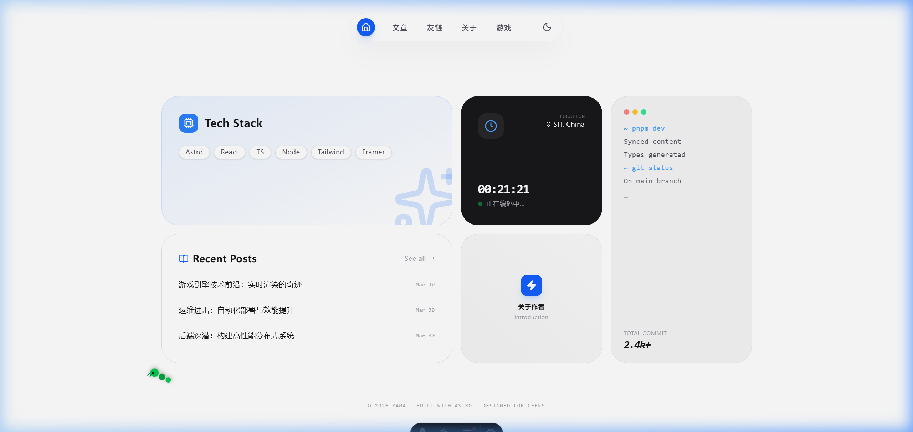
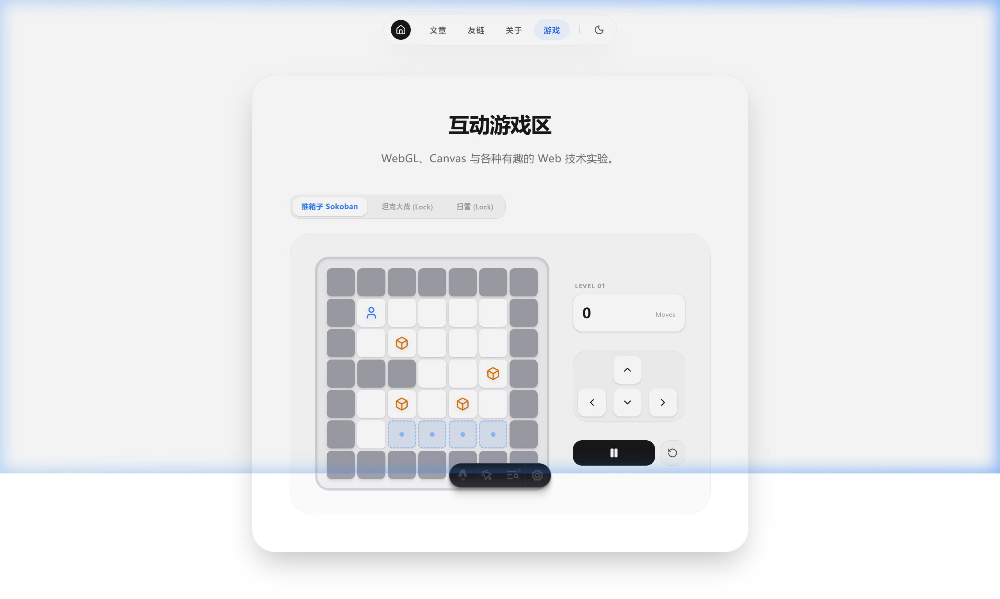

<div align="center">
  <p>
    <a href="./README.md">English</a> | 
    <a href="./README.zh.md">简体中文</a> | 
    <a href="./README.ja.md">日本語</a>
  </p>
</div>

# 🌌 Astro-Yama: Geek's Bento Universe

A highly personalized, geek-themed personal site built with **Astro 6**. It merges modern Bento aesthetics with a retro-hacker spirit to create a unique digital playground.



## 🎨 Core Design Philosophy

The essence of this site lies in **"Interactive Aesthetics."** We reject mediocre static layouts, using carefully crafted micro-interactions, 3D visuals, and pixel art to provide a distinct exploration journey for every visitor.

### 🌟 Key Features

*   **Bento Grid Dashboard**: A modern, modular layout that fits all screens, elegantly aggregating core entry points.
*   **3D Orbital Friends**: Say goodbye to traditional lists. This is a planetary gravity system where friend avatars rotate in 360° orbits.
*   **Game Lab**: Built-in interactive mini-games (e.g., Sokoban), supporting both keyboard and touch controls to showcase the possibilities of Web tech.
*   **Sigma Persona Profile**: A deeply integrated i18n solution (ZH/EN/JA) with seamless transitions and a sharp "Sigma" style visual.
*   **Geeky Details & Animations**:
    *   **Grid Caterpillar**: A code-bug crawling along the Bento edges.
    *   **Pixel Cat "Back to Top"**: A pixel-art black cat resting on the scrollbar that dashes to the sky upon your click.
    *   **Bubble Flood Mask**: A unique page rendering splash screen that opens the visit with a ripple of light and bubbles.

## 🛠️ Tech Stack

*   **Framework**: [Astro 6](https://astro.build/) (Island Architecture)
*   **UI Components**: [React 19](https://reactjs.org/)
*   **Styling**: [Tailwind CSS 4](https://tailwindcss.com/)
*   **Animations**: [Framer Motion](https://www.framer.com/motion/)
*   **State Management**: [Nanostores](https://github.com/nanostores/nanostores)
*   **Icons**: [Lucide React](https://lucide.dev/)

## 📸 Screenshots

| Game Lab | About Profile (i18n) |
| :---: | :---: |
|  |  |
| **3D Orbit Friends** | **Dark Mode Support** |
|  | (Native smooth transitions) |

## 🚀 Quick Start

### 1. Clone and Install
```bash
git clone https://github.com/your-username/astro-yama.git
cd astro-yama
pnpm install
```

### 2. Start Dev Server
```bash
pnpm dev
```
Preview at `http://localhost:4321`.

### 3. Build for Production
```bash
pnpm build
```

---

## 📝 License

This project is open-sourced under the [MIT License](LICENSE).

> **Geek's Creed**: *Seek the singularity of aesthetics and logic in the binary wasteland.*
